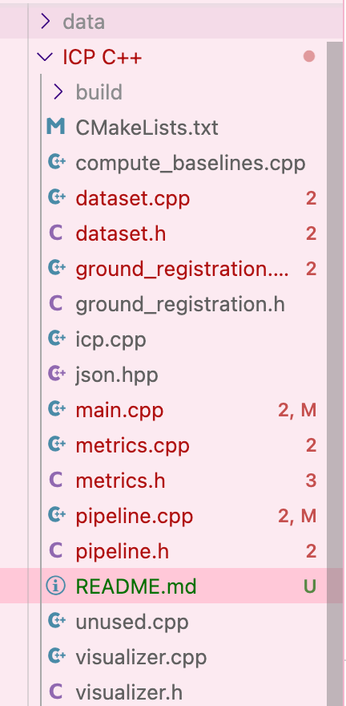

# Vehicle Edge Raw Point Cloud Fusion
by BEN GIACALONE, CHINMANY KULKARNI, and JOHN MIHAL

Dataset:
https://drive.google.com/file/d/1tqE87G9Uu1UDn3gyZuOIM-KwPKhCcqun/view?usp=share_link

## Using the system:

Put the uncompressed data next to the ICP C++ folder.
Like so:


Now open terminal and go inside the "ICP C++" folder.

From there run ``` cmake .. ```

now go into the build folder that was just created.

run ```make``` to build the project.

From here you can run ```./main``` to run the code.

Inside main.cpp are blocks of code you can uncomment or comment to run difference testing scenarios. Make sure to run ```make``` again after any changes to build the code before running.

## Explanation of the code:
### main.cpp
Everything runs from here. This is where you choose your pipeline and metric output system.

### dataset.cpp
This class stores the dataset object, a list of frames and positions. Creating one of these tells you what files the dataset will conatin.

### pipeline.cpp
This conatins the pipeline, the code that does the transformations. This class has several different pipelines and options you can try from. The StdPipline is the standard pipeline with all features. SimplePipleine is only ICP. NoRotPipeline uses the ground truth rotation, this one gives very good results. It shows how rotation was the hard part. Other pipelines such as InterpolationPipeline were for development

### metrics.cpp
This code runs the pipeline and reports the metrics back to the used in the command line. Metrics include rte, rre, time, % frames computed, success rate, and this is all split into easy and hard frames.

### ground_registration.cpp
This conatins the ground plane registration algroithims that pipeline uses.

### visualizer.cpp
Shows a view of aligned and unaligned point clouds. Insert a vizuliser anywhere with ```create_visualizer(...)```. This was used for debugging and presentation purposes. 

### Unused files:
#### icp.cpp
Original icp implementation and testing.
#### computer_baselines.cpp
Original benchmark implementation.
#### unused.cpp
Contains unused code from development.
